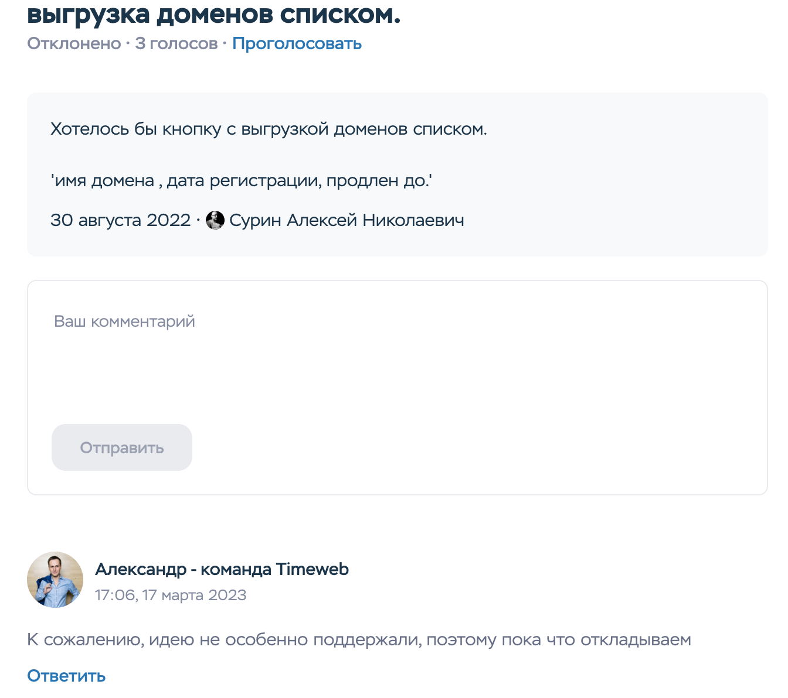
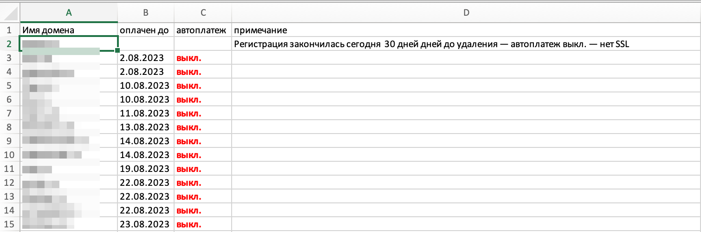

  ## Выгрузка всех доменов из ПУ таймвеба в Excel файл

На таймвеб в разделе домены, не хватает одной маленькой кнопочки:

писал в "есть идея" , но 

получил вот это:

  

поэтому появился данный  ~~костыль~~ скрипт, который решает эту задачу.

от вас требуется в ПУ перейти в раздел **домены** -> **мои домены**, внизу страницы выбрать показывать все домены, далее сохранить страницу полностью в html формате (по умолчанию скрипт берет данные из файла **dom1.html**, имя файла правится в [тут](https://github.com/zelib0ba/timeweb-domain-list-export/blob/e66ad74ffb377e3ca1816d9950729ab68356d32e/main.py#L18C2-L18C2) ), запустить скрипт. На выходе вы получите файл **twDomains.xlsx** : 

